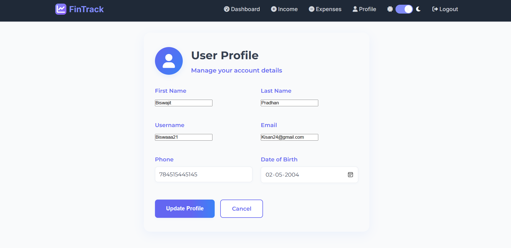

# 💸 FinTrack – Personal Finance Tracker Web App

A modern and user-friendly **Finance Tracker Web App** built using **Python**, **Django**, and **Bootstrap**, designed to help users manage their **income**, **expenses**, and **financial goals** in one place. Built with professionalism, security, and a clean UI inspired by top fintech apps like Groww and Jupiter.

---

## 🚀 Features

- 🔐 **User Authentication**
  - Secure login & sign-up system
  - Password-protected access with session handling

- 📥 **Income Management**
  - Add, update, and view income entries
  - Categorized income types (e.g., Freelancing, Salary, Bonus)

- 💸 **Expense Tracking**
  - Add, update, and view expense entries
  - Assign custom categories (e.g., Food, Shopping, Travel)

- 📊 **Interactive Dashboards**
  - Income vs Expense comparison graph
  - Expense category-wise pie chart
  - Monthly tracking progress bars

- 🧾 **Real-Time Balance Calculation**
  - Shows total income, total expenses & current balance (in ₹)

- 👤 **User Profile Management**
  - Update name, email, username
  - View profile and transaction history

- 🎯 **Monthly Budget Overview**
  - Set budget limits
  - Visual progress bars for budget tracking

- 🗂️ **Responsive UI**
  - Clean, mobile-friendly layout using Bootstrap
  - Dashboard layout with sticky navbar

---

## 🧠 Tech Stack

- **Backend:** Python 3, Django
- **Frontend:** HTML5, CSS3, Bootstrap 5
- **Database:** SQLite (default), easily upgradable to PostgreSQL
- **Graphing Library:** Chart.js
- **Hosting Options:** Replit, Render, PythonAnywhere, Vercel (frontend only)

---

## 📸 Screenshots

| Feature | Screenshot |
|--------|------------|
| 🔠Login Page |  |
| 📊 Dashboard Charts |  |
| 💰 Income Entry Page |  |
| 💸 Expense Entry Page |  |
| 👤 User Profile |  |

